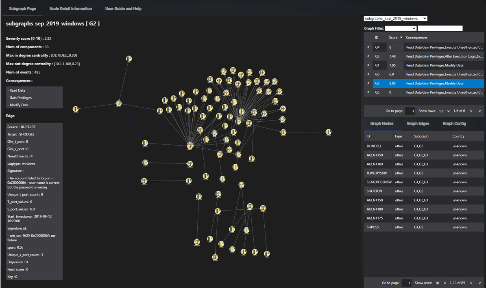
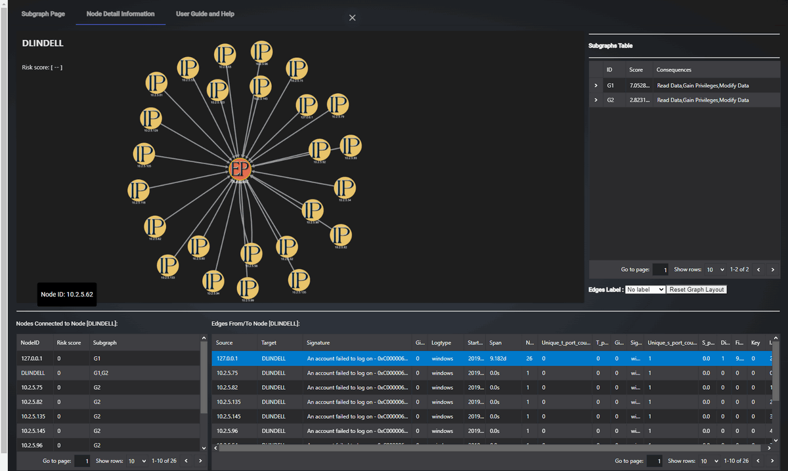
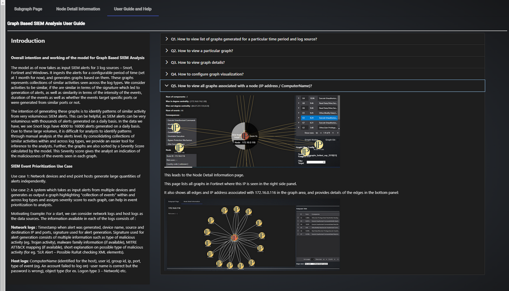

# Graph-Based SIEM Log Analysis Dashboard

**Program Design Purpose**: The purpose of this program is to develop a Graph-Based SIEM (System Information and Event Management) dashboard that visualizes network communication patterns by processing and analyzing logs from firewalls, host computers, and other security devices. This dashboard will help security analysts quickly identify and investigate potential threats by using a Cytoscape-style Node-Edge graph for intuitive data representation. The program is an angular plug in which can integrate in other SIEM visualization system to provide an intuitive and easy-to-navigate dashboard for security analysts to quickly interpret data with the function like search, filtering, and custom views to allow users to tailor the analysis based on their needs.

The program key Features include: `Node-Edge Graph Visualization`, `Integration with Multiple Log Sources`,  `Automated Event Filtering and Prioritization` and `Data Correlation and Analysis`. It aims to bridge the gap between overwhelming volumes of security logs and actionable insights by providing a powerful, graph-based tool for visualizing, analyzing, and prioritizing network security events.

```
# Version:     v0.1.2
# Created:     2022/10/31
# Copyright:   Copyright (c) 2024 LiuYuancheng
# License:     MIT License 
```

[TOC]

------

### Introduction

The Graph-Based SIEM Log Analysis Angular plugin is a web-based SIEM (System Information and Event Management) platform dashboard that visualizes network communication patterns using a Cytoscape-style node-edge graph. The platform provides various function pages and panels to help security analysts quickly identify and analyze patterns within the large volumes of SIEM alerts. The dashboard main user interface view is shown below:


The four key features of the program:

- **Node-Edge Graph Visualization**: Represent network nodes (e.g., servers, workstations, routers) as graph nodes, and connections or communication events between them as edges. we use dynamic, interactive graph visualization to allow analysts to zoom, filter, and focus on specific parts of the network and highlight suspicious nodes and connections to draw attention to potential security threats.
- **Integration with Multiple Log Sources**: Aggregate and correlate logs from multiple sources, including Firewalls, Intrusion Detection Systems (IDS), Host Operating Systems.
- **Automated Event Filtering and Prioritization**: Filtering to prioritize events based on predefined rules, Identify and highlight high-risk events that need immediate human intervention, helping analysts focus on the most critical alerts.
- **Data Correlation and Analysis**: Correlate events from different log sources to detect patterns indicative of multi-stage attacks or complex threat scenarios. Enable deeper analysis by linking related events across the network, helping to understand the context of security incidents.

The platform ingests alerts over a configurable period (currently set to 1 month) and generates visual representations of similar activities detected across different log types. Activities are considered similar based on factors such as event signatures, intensity, duration, and specific ports targeted or used. This approach enables faster, more efficient threat identification, allowing security analysts to make informed decisions based on clearer, data-driven insights.


------

### Data Sources Detail

The system processes logs from three primary sources: **Snort Intrusion Detection System (IDS) logs**, **Fortinet firewall network logs**, and **Windows OS network logs**. These logs can generate thousands of alerts daily, making manual analysis challenging and time-consuming. For instance, Snort IDS logs alone can produce between 4,000 to 16,000 alerts each day. To address this, the platform consolidates similar activities across these log types, simplifying the identification of critical patterns. It further sorts the data using a `Severity Score`, which indicates the potential maliciousness of events, helping analysts prioritize their investigations.

The datasets utilized in this project include:

- **Snort IDS Logs**: Source IP, target IP, source and target ports, signature identifier, and SIEM type.

- **Fortinet Firewall Logs**: Source IP, target IP, source and target ports, event identifier, and SIEM type.

- **Windows Alerts Logs**: Source IP, port, computer name, Windows event ID, and SIEM type.

- **IDS Signature Details**: Contains brief descriptions of event types (e.g., "trojan activity suspected"), along with associated CVE (Common Vulnerabilities and Exposures) information, MITRE ATT&CK tactics, and techniques. Each signature has a class type and score.

- **Firewall Signature Details**: Includes detailed descriptions related to each event identifier, associated CVEs, and a list of potential impacts.

- **Windows Event Information**: Provides descriptions of Windows event types.

- **MITRE ATT&CK Documentation**: Extracted via MITRE's API, containing information on tactics and techniques, associated Windows event IDs, and taxonomy values like CAPEC (Common Attack Pattern Enumeration and Classification) IDs.

- **CAPEC Documentation**: Enumerates various attack patterns at different abstraction levels. Each CAPEC entry includes a title, description, severity score, and possible impacts.

- **CVE Data**: Downloaded from NIST’s website, this data contains CVE descriptions and scores.

The analysis of these data sources involved using Python scripts and manual inspection to identify ground truth. From this analysis, 14 suspicious cases or sets of events were identified across all three types of logs, providing a basis for further investigation and system improvement.

**What are linked Subgraphs?**

Linked graphs are graphs generated by connecting events across log types - Snort, Fortinet and Windows.

Hence, if graphs generated in Snort and Fortinet have IP addresses in common, then linked graphs between Snort and Fortinet would be generated by connecting these individual graphs, re-calculating the graph severity and consequences. For example:

- Linked Subgraphs `all_logs_sep_2019` contains those graphs which have nodes (IP addresses) found in alerts across all 3 log types - Snort, Fortinet and Windows. 
- Linked Subgraphs `Snort_forti_sep_2019` contains those graphs which have nodes (IP addresses) found in alerts across all Snort and Fortinet. 
- Linked Subgraphs `win_snort_sep_2019` contains those graphs which have nodes (IP addresses) found in alerts across all Snort and Windows.


------

### System Design 


#### Dashboard User Interface Design 

The Graph-Based SIEM Log Analysis Dashboard contents three main tabs:

**SIEM Log Graph Tab**: Displays case-specific subgraphs, allowing users to view and analyze subsets of the data based on selected cases. Each subgraph visually represents network communication patterns and potential security events.

**Node Detail Tab**: Provides detailed information about a selected node, including its attributes, connections, and relationships within the graph. This view helps users focus on specific nodes and investigate their interactions in greater depth.

**User Guide Tab**: Offers comprehensive instructions on how to navigate and use the platform, ensuring that users can make the most of the dashboard's features and functionalities.

#### SIEM Log Graph Tab Design

The **SIEM-Graph Tab** is the primary interface for visualizing network communication patterns and potential security events. It displays case-specific subgraphs, enabling users to analyze subsets of data based on selected cases.

**Web Page Layout**:

The page is divided into two main areas:

- **Graph Display Area (Left Side)**
- **Information View & Control Area (Right Side)**

The SIEM Log Graph Tab UI is shown below:



**Graph Display Area**

- **Top Left Information Panel**: Provides key details for each graph:
  - **Title**: Shows the dataset name and subgraph ID.
  - **Severity Score**: Displays the severity score, indicating the threat level as calculated by the model.
  - **Number of Events**: Total count of SIEM alerts consolidated to form the graph. For example, a graph labeled "G5" may consolidate 336 individual alerts, significantly reducing the manual effort required for analysis.
  - **Number of Components**: Indicates the spread of the activity across collections of IP addresses, showing whether suspicious behavior is concentrated or widespread.
  - **Max In-Degree Centrality**: Identifies the node (IP address or computer name) with the highest number of incoming edges, indicating targeted behavior.
  - **Max Out-Degree Centrality**: Identifies the source(s) for most edges, showing if behavior originates from a single source or multiple.
  - **Consequences**: Lists potential consequences inferred from the activity patterns, aiding in quick threat assessment.
- **Graph Visualization**: Center of the page, where the graph is displayed. Users can interact with the graph, and detailed information appears upon clicking nodes or edges.
- **Node/Edge Details**: Clicking on a node or edge reveals specific information at the bottom left corner, including attributes and relationships.

**Information View & Control Area (Right Side)**

- **Dataset Selection**: Users can select datasets from a dropdown menu, apply filters, and display the relevant graph.
- **Graph Node Sub-Tab**: Lists detailed information about all nodes within the displayed graph, facilitating deeper inspection.
- **Graph Edge Sub-Tab**: Lists detailed information about all edges within the graph, providing insights into connections and interactions.
- **Graph Config Sub-Tab**: Allows users to configure graph display styles and apply filters to nodes and edges, enhancing visualization clarity.


#### Node Detail Tab Design

The **Node Detail Tab** provides a focused view on a specific node and its connections. When users right-click a node in the SIEM-Graph tab and select "Show Detail," the page automatically switches to this tab, displaying a new graph centered on the selected node. The UI view is shown below:



**Web Page Layout**

The layout is similar to the SIEM-Graph tab but focuses on the selected node's connections.

- **Graph Visualization**: Displays the selected node along with its neighboring nodes and edges. This visual helps users understand the immediate environment of the node.
- **Information Tables**:
  - **Neighbors Table**: Lists information about neighboring nodes and their attributes.
  - **Edges to Neighbors Table**: Shows details of the connections between the node and its neighbors.
  - **Parent Subgraph Table**: Provides information about the parent subgraph from which the node was selected.

**Edge Information**

Clicking an edge in the graph highlights it and displays the following attributes:

- **Signature**: Indicates signatures associated with the consolidated alerts.
- **Number of Events**: Total number of alerts forming the edge.
- **Start Timestamp**: Earliest recorded alert time.
- **Dispersion**: Measures the intensity of alerts, with values closer to 1 indicating bursts of activity.
- **Span**: Duration across which the alerts were observed.
- **Source Ports (S_Port_Values)** and **Target Ports (T_Port_Values)**: Ports involved in the alerts.
- **Gini Coefficient (Gini_S_Port and Gini_T_Port)**: Measures the distribution of ports, with values closer to 0 indicating random port selection.


#### User Guide Tab Design

The **User Guide Tab** provides users with comprehensive instructions on how to navigate and use the platform. It ensures that both new and experienced users can efficiently interact with the dashboard’s features. The UI view is shown below:



**Web Page Layout**:

- **General Introduction**: Overview of the platform's purpose and key functionalities, including background information on the research.
- **Step-by-Step Guide**: Instructions on how to use each of the dashboard’s features, from data selection to detailed graph analysis.
- **FAQs**: Common questions and troubleshooting tips, helping users resolve issues quickly.
- **Glossary**: Definitions of technical terms, ensuring users understand key concepts.


------

### SIEM Prioritization Use Case

The platform employs two main use cases for prioritizing events within the System Information and Event Management (SIEM) environment:

**Use Case 1: Independent Alert Generation by Network Devices and Endpoint Hosts**
Network devices and endpoint hosts independently generate large volumes of alerts, each containing critical information for threat analysis.

- **Network Logs**: Each alert includes a timestamp, device name, source and destination IP addresses, and ports, along with a signature that identifies the reason for the alert. The signature provides multiple layers of information, such as the type of malicious activity (e.g., Trojan activity), related malware families (if available), MITRE ATT&CK mappings (if applicable), and a brief description of the potential threat (e.g., "SLR Alert – Possible RuRat checking XML elements").

**Use Case 2: Aggregated Event Collection and Prioritization Across Multiple Devices**
The system integrates alerts from multiple sources and generates a consolidated graph that highlights "collections of events" across different log types. By analyzing these event clusters, the platform assigns a severity score to each graph, allowing security analysts to prioritize their focus on critical threats.

- **Host Logs**: Key information includes the computer name (host identifier), user ID, group ID, IP, port, event type (e.g., account login failures where the username is correct but the password is wrong), and object type (e.g., "Logon type 3 – Network").

**Motivating Example**:
To illustrate, the platform can begin by using both network and host logs as data sources. Each type of log provides detailed information essential for threat detection and analysis, enabling the system to correlate events and effectively prioritize them for further investigation.

#### Potential Use Cases

There are also some potential use cases which the system can be applied for:

- **Detecting Lateral Movement**: Track and visualize how an attacker moves across the network after compromising a system.
- **Identifying DDoS Attacks**: Visualize and correlate traffic spikes and unusual communication patterns to identify potential Distributed Denial of Service (DDoS) attacks.
- **Monitoring Data Exfiltration**: Track data flows to detect abnormal outbound connections that may indicate data theft.
- **Investigating Failed Login Attempts**: Correlate multiple failed login events across different systems to identify potential brute-force attack attempts.


------

### Program Setup and Execution

This section outlines the program file structure, environment setup, and steps for executing the Graph-Based SIEM Log Analysis Dashboard. Follow these instructions to correctly configure and run the system.

- **Development env**: Angular 14.0 (Typescript)
- **Hardware need**: N.A

**Program Files List** 

| Program file/folder     | Execution Env | Description                                   |
| ----------------------- | ------------- | --------------------------------------------- |
| `src/*`                 | Typescript    | Main dashboard host program.                  |
| `src/nodedetail/*`      | Typescript    | Node detail page components.                  |
| `src/data/*`            | Typescript    | All the test-case data files.                 |
| `src/cytoscape/*`       | Typescript    | Customized cytoscape graph module components. |
| `siem-graph/*`          | json          | All the data files used for demo.             |
| `images.zip`            |               | All image/icon files used by the web.         |
| `app-routing.module.ts` |               | The routing module.                           |

#### Program Execution

**Copy file to the position** 

- Copy `src` folder to your `Project<fusion-cloudy>\src\app\pages` folder. 
- Copy `siem-graph` folder to your `Project<fusion-cloudy>\src\assets\data` folder. 
- unzip `images.zip` and copy `images` folder to your `Project<fusion-cloudy>\src\assets` folder. 
- Import the `graph-siem-component` in your project 's routing module as shown in the `app-routing.module.ts`.

**Program execution command** 

```
npm run dev
```

**View the webpage**: After the compile process in the previous steps finished open the browser and type in the url: http://localhost:4200/

For the detail program usage, please refer to the usage manual: [Usage Manual Doc](UsageManual.md)

------

### Reference Link

- Flex layout exmaple: https://livebook.manning.com/book/angular-development-with-typescript-second-edition/chapter-7/39
- cytocapte.Js API: https://js.cytoscape.org/#ele.isEdge
- Call parent function from child angular: https://stackblitz.com/edit/calling-parent-function-from-child-component?file=src%2Fapp%2Fparent-component%2Fparent-component.component.html
- How to pass value in parent function: `<app-cytoscape #cygraph (parentFun)="parentFun($event)"></app-cytoscape>`
- Config color set from online: https://coolors.co/palettes/trending
- Node selector setup: https://dash.plotly.com/cytoscape/styling
- Dev Tips: jxgrid need to be init after sidebar or dialog box to display the table instead of separate tab. https://www.primefaces.org/primeng/showcase/#/sidebar
- Text icon generator: https://cooltext.com/Logo-Design-Simple

------

> Last edit by LiuYuancheng(liu_yuan_cheng@hotmail.com) at 31/10/2024,  if you have any problem, please send me a message. 

