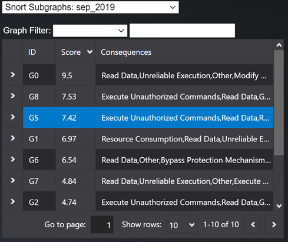
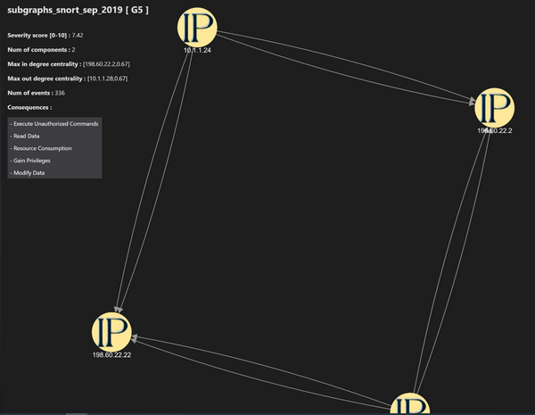
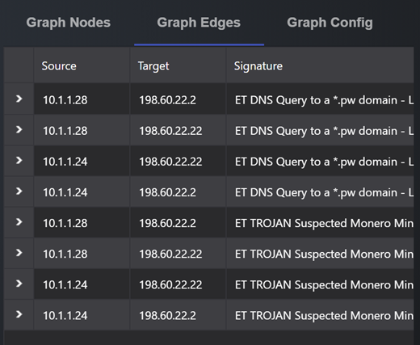
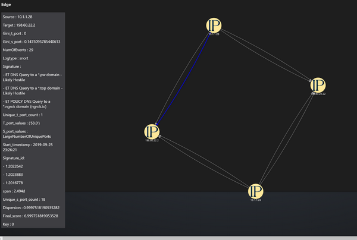
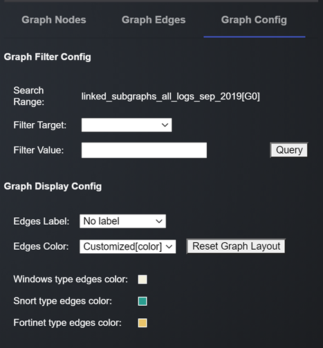
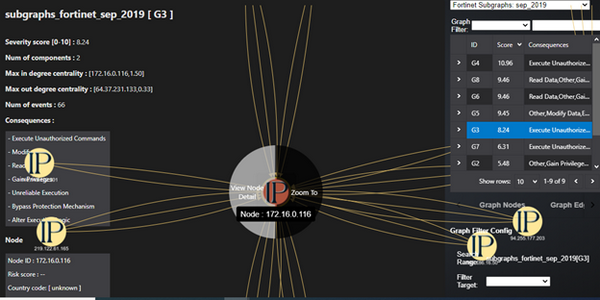
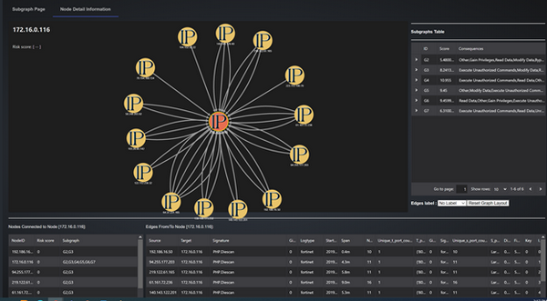

# Graph-Based SIEM Log Analysis Dashboard Usage Manual

This manual will provide users with comprehensive instructions on how to navigate and use the dashboard plugin. 

```python
# Version:     v0.1.2
# Created:     2024/10/24
# Copyright:   Copyright (c) 2024 LiuYuancheng
# License:     MIT License 
```

**Table of Contents**

[TOC]

- [Graph-Based SIEM Log Analysis Dashboard Usage Manual](#graph-based-siem-log-analysis-dashboard-usage-manual)
    + [View the list of graphs generated for a particular time period and log source](#view-the-list-of-graphs-generated-for-a-particular-time-period-and-log-source)
    + [View a particular graph in the dataset](#view-a-particular-graph-in-the-dataset)
    + [View graph details](#view-graph-details)
    + [Configure graph visualization](#configure-graph-visualization)
    + [View all graphs associated with a node (IP address / Computer Name)](#view-all-graphs-associated-with-a-node--ip-address---computer-name-)

------

### View the list of graphs generated for a particular time period and log source

Currently the project provides the demo graphs generated for September 2019 and June 2020. Our log sources are SIEM alerts for Snort, Fortinet and Windows. There are several data set in the folder: 

| Idx  | Log Type           | Log Dataset Data base ID                                     |
| ---- | ------------------ | ------------------------------------------------------------ |
| 0    | Snort Subgraphs    | `subgraphs_snort_sep_2019`, `subgraphs_snort_june_2020`      |
| 1    | Windows Subgraphs  | `subgraphs_windows_sep_2019`, `subgraphs_windows_june_2020`  |
| 2    | Fortinet Subgraphs | `subgraphs_fortinet_sep_2019`, `subgraphs_fortinet_june_2020` |
| 3    | Linked Subgraphs   | linked_subgraphs_all_logs_sep_2019, linked_subgraphs_snort_forti_sep_2019, linked_subgraphs_win_snort_sep_2019, linked_subgraphs_snort_forti_june_2020, linked_subgraphs_win_forti_june_2020 |

You can view the list of graphs for a particular log source and month by the dropdown menu (as shown below):


`Figure-06 graph data file selection drop down menu screen shot, version v0.1.2 (2024)`

For example, to view list of graphs generated for Snort alerts, for September 2019, select Snort Subgraphs: sep_2019.


------

### View a particular graph in the dataset

Once the user selects a log source and time period from the dropdown as shown in Q1, the list of subgraphs are shown below. For example, if the user selects Snort Subgraphs : `sep_2019`, the list of graphs generated for Snort alerts for September 2019 would be shown as below: 



`Figure-07 Graph selection table screen shot, version v0.1.2 (2024)`

The list provides a graph ID (eg. G5), Severity score of the graph (eg. 7.42) and list of possible consequences identified based on the types of signatures seen in the graph (eg. Execute Unauthorized commands, Read Data etc). 

The left panel of the UI shows the graph and related information:



`Figure-08 Nodes Communication Graph screen shot, version v0.1.2 (2024)`

The top left portion of the left panel gives high level information for each graph:

- **Title** : dataset name [subgraph ID]

- **Severity score :** Severity score of the graph calculated by the model. 
- **Num of events** : Total number of SIEM alerts consolidated by the model to build the graph. For example, in the screen shot above, graph G5 consolidates information seen in 336 individual alerts in the SIEM data. If the analyst did not have access to graph G5, they would have to infer this information by analyzing 336 alerts themselves. 
- **Num of components :** Each graph represents a certain type of activity seen across a log type for 1 month. For example, in G5 the graph consolidates suspicious DNS queries seen across Snort logs. Such activities can be seen across 1 collection of IP addresses or multiple collections. The Num of Components tells the analyst the spread of such activity about how many collections of IP addresses are experiencing this activity.
- **Max in degree centrality** : Which node (IP address / Computer Name) has the maximum number of incoming edges? If the value is high ( near 1 or higher than 1), that implies most of the edges are targeted to a specific node. If the value is less, it implies the targets are a range of IP values. 
- **Max out degree centrality** : Similar to Max in degree centrality, tells if the source for most edges is 1 or 2 IP values, or its spread across various values. 
- **Consequences** : Possible types of consequences which may result based on the signature and other activity patterns seen in the graph. 


------

### View graph details

Details on the graph edges can be viewed in the right side panel under Graph Edges:



`Figure-09 All edge detailed informaion table screen shot, version v0.1.2 (2024)`

Selecting a particular edge from the Graph Edges section highlights the edge in the graph visualization as well. Each edge has the following information: 



`Figure-10 One edge detailed informaion screen shot, version v0.1.2 (2024)`

- **Signature** : Which signatures have been seen in the alerts consolidated in the edge. 
- **NumOfEvents** : How many alerts from the SIEM logs have been consolidated to form the edge. 
- **Start_timestamp** : Earliest timestamp at which the alerts were seen. 
- **Dispersion** : Intensity of alerts – were the alerts generated in a burst of activity, or were periodic in nature. Value closer to 1 indicates high intensity. 
- **Span** : Duration for which alerts were seen through the month (for ex. 2.49d - ~2.5 days). 
- **S_port_values** and T_port_values : Source and Target ports seen in the alerts. 
- **Gini_s_port** and **Gini_t_port** : Wherever large number of ports are seen, were the ports randomly chosen, or concentrated in a few port values. Value closer to 0 indicates the ports were randomly chosen. 


------

### Configure graph visualization

Graph visualization can be configured through the Graph Config tab in right side panel: 



`Figure-11 Graph visulization config screen shot, version v0.1.2 (2024)`

User can choose to see `Signature` / `Log Type` / `Port Values` etc as the edge labels by selecting from the dropdown against Edges Label in the **Graph Display Config**.

Similarly, the edge colors can represent the log types which have resulted in the creation of the edge. This functionality is useful when viewing linked graphs. 

The user can also filter edges to view in a graph through the **Graph Filter Config** area. 


------

### View all graphs associated with a node (IP address / Computer Name)

Certain nodes are seen across multiple graphs. To view all graphs in Fortinet associated with an IP address (eg. 172.16.0.116), select the node and press left button for some time, and the click on View Node Detail :



`Figure-12 Step to view a signle node direct connection, version v0.1.2 (2024)`

This leads to the Node Detail Information page. 

This page lists all graphs in Fortinet where this IP is seen in the right side panel. 

It also shows all edges and IP address associated with 172.16.0.116 in the graph area, and provides details of the edges in the bottom panel:



`Figure-13 Selected node direct connection graph, version v0.1.2 (2024)`


------

>  Last edit by LiuYuancheng(liu_yuan_cheng@hotmail.com) at 24/10/2024,  if you have any problem, please send me a message. 