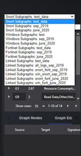

# Graph-Based SIEM Log Analysis Dashboard Usage Manual

This manual will provide users with comprehensive instructions on how to navigate and use the platform. 

[TOC]

------

#### View the list of graphs generated for a particular time period and log source

Currently the demo shows graphs generated for September 2019 and June 2020. Our log sources are SIEM alerts for Snort, Fortinet and Windows. There are several data set in our data base: 

| Idx  | Log Type           | Log Dataset Data base ID                                     |
| ---- | ------------------ | ------------------------------------------------------------ |
| 0    | Snort Subgraphs    | `subgraphs_snort_sep_2019`, `subgraphs_snort_june_2020`      |
| 1    | Windows Subgraphs  | `subgraphs_windows_sep_2019`, `subgraphs_windows_june_2020`  |
| 2    | Fortinet Subgraphs | `subgraphs_fortinet_sep_2019`, `subgraphs_fortinet_june_2020` |
| 3    | Linked Subgraphs   | linked_subgraphs_all_logs_sep_2019, linked_subgraphs_snort_forti_sep_2019, linked_subgraphs_win_snort_sep_2019, linked_subgraphs_snort_forti_june_2020, linked_subgraphs_win_forti_june_2020 |

You can view the list of graphs for a particular log source and month by the dropdown menu (as shown below): For example, to view list of graphs generated for Snort alerts, for September 2019, select Snort Subgraphs: sep_2019. As shown in the example below:

